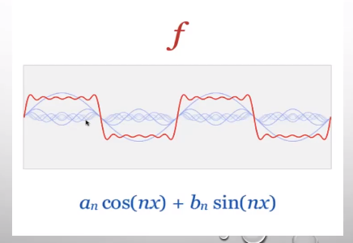

**Analog to Digital Audio**:

The array of sampled values from the electrical signal is <u>digital audio</u>.

Sampling rate = $44,100$ samples per second (CD quality).

Analog signal $s(t) \rightarrow$ digital signal $\{ y_0, y_1, ..., y_n \}$.

- $y_i$: array of 16-bit (*bit depth*); one bit for sign, 15 bits for value.

**Period, Amplitude and Frequency**:

A signal that exhibits the same repeated pattern (cycle) is <u>periodic</u>.
$$
\textrm{period} = \frac{1}{\textrm{frequency}}
$$
**Sinusoids**:

Both $y = \sin t$ and $y = \cos t$ completes one cycle in $2\pi$ seconds:

- $y = \sin t, \ t \in [0,2\pi]$ (one cycle in $2\pi$ seconds);
- $y = \sin (2\pi t), \ t \in [0,1]$ (one cycle in $1$ second = $1$ Hz).
- $y = \sin (2\pi \boldsymbol{f} t), t \in [0,1]$ ($f$ cycles in $1$ second = $f$ Hz).

**Real Sinusoids**:

$y = a \sin (2\pi ft + \phi)$ and $y = a \cos (2\pi ft + \phi)$.

- $a$ : amplitude;
- $f$ : frequency (Hz);
- $\displaystyle\frac{1}{f}$ : period (s);
- $\phi$ : phase (radians).
- $\omega = 2\pi f$ : [angular frequency](https://en.wikipedia.org/wiki/Angular_frequency).

*Example*: Middle C (or C4) has frequency $261.6$ Hz.

- $y(t) = \sin (2\pi \cdot 261.6 \cdot t), \ t \in [0,2]$.

**C major**:

The C major chord (C-E-G) has frequencies $261.6$ Hz, $329.6$ Hz and $392$ Hz.

The analog signal for this chords is:
$$
y(t) = \sin (2\pi \cdot 261.6 \cdot t) + \sin (2\pi \cdot 329.6 \cdot t) + \sin (2\pi \cdot 392.0 \cdot t) .
$$
**Loudness vs Pitch**:

*Loudness* is our brain's perception of amplitude.

*Pitch* is our brain's perception of frequency.

- Our perception of pitch is based on the logarithm of frequency.
- The interval between two notes is the perceived difference between the two pitches.
- As a result, the interval we hear from two notes depends on the ratio of their frequencies, not the difference.

**Octave**:

- A3: $220$ Hz; A4: $440$ Hz; A5: $880$ Hz.
  - Perceived interval A4, A3 $= \log(440) - \log(220) = \log(440/220) = \log 2$.
  - Perceived interval A5, A4 $= \log(880) - \log(440) = \log(880/440) = \log 2$.

**Piano keys**:

An 88-key piano has frequencies given by:
$$
f(n) = 440 \big(\sqrt[12]{2} \big)^{n-49}, \quad n = 1,2,...,88
$$

- $f(1) \approx 27.5$ Hz (A0).
- $f(88) \approx 4186$ Hz (C8).

**Fundamental frequency and overtones**:

<u>Pure tone</u>: one frequency.

- Most sounds are more complex.
  - E4 piano note = supposition of many frequencies: $330$ Hz, $660$ Hz, $990$ Hz, $1320$ Hz and $1650$ Hz.
  - Fundamental frequency: $330$ Hz.
  - Overtones or harmonics: $660$ Hz, $990$ Hz, $1320$ Hz and $1650$ Hz.

**Time vs Frequency Domain**:

In the <u>time domain</u>, the voltage/current signal is a function of time.

In the <u>frequency domain</u>, the signal is represented as a function of frequencies that are present in the signal.

- The set of frequencies in a signal and their magnitude is called <u>spectrum</u> of the signal.

A major chord:

**Discrete Fourier Transform**:

**Important take-aways**:

- Digital audio is simply sampling from a continuous, analog function at some sampling rate producing an array of numbers.
- Sinusoids take on the form $y = a \sin (2\pi ft + \phi)$.
- Pitch is our brain's perception of frequency (log scale).
  - Fundamental frequency vs harmonics.
- Time and frequency domains are two equivalent representation of a signal.
- The DFT and the Inverse Discrete Fourier Transform (IDFT) allows us to go back and forth between representations.

